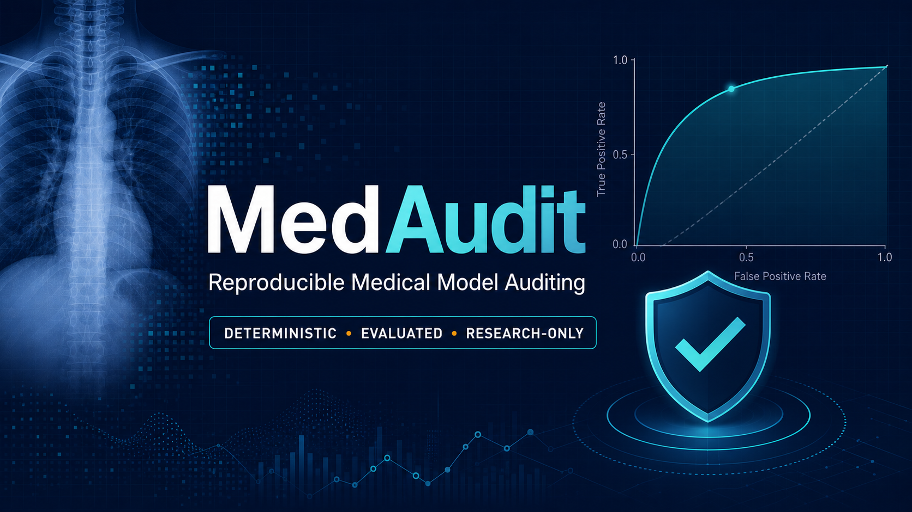
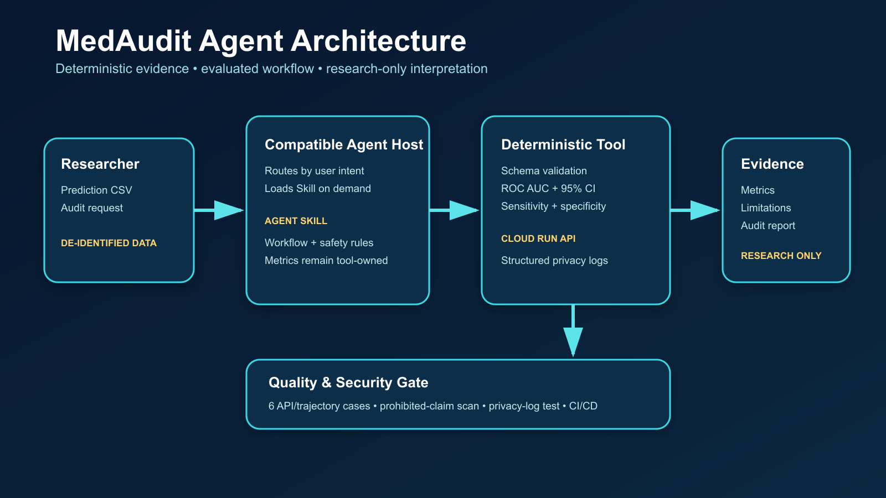

# MedAudit PneumoniaMNIST Baseline





A small, self-contained research project that trains a NumPy logistic-regression
baseline on PneumoniaMNIST, exports test predictions in the MedAudit CSV format,
and displays the results through a Flask web application.

## Included data

- `data/raw/pneumoniamnist.npz`: official MedMNIST v2 archive (5,856 images).
- `data/processed/pneumoniamnist_test_predictions.csv`: 624 test predictions.

PneumoniaMNIST is based on pediatric chest X-rays, resized to 28 x 28 grayscale
pixels. Labels are `0 = normal` and `1 = pneumonia`. The dataset is licensed
under CC BY 4.0. Source: https://zenodo.org/records/6496656

The prediction scores are generated locally by this project. They are not
clinically validated outputs.

## Run in Google Antigravity or a terminal

Open this folder as the project workspace, then ask Antigravity to follow
`AGENTS.md`, or run:

```bash
python3 -m venv .venv
source .venv/bin/activate
python -m pip install --upgrade pip
python -m pip install -r requirements.txt
python scripts/build_predictions.py
python evals/run_evals.py
python -m unittest discover -s tests -v
python app.py
```

Open http://127.0.0.1:8080.

Deployed Cloud Run version:
https://medaudit-statistics-tool-770349538120.us-east1.run.app

Kaggle writeup: `docs/KAGGLE_WRITEUP.md`.

Kaggle submission package and video script: `docs/SUBMISSION_PACKAGE.md` and
`docs/VIDEO_SCRIPT.md`.

Production specification and Capstone summary:
`docs/SPEC.md` and `docs/CAPSTONE.md`.

If port 8080 is occupied, use `PORT=8081 python app.py` and open
http://127.0.0.1:8081 instead.

## Expected verification

- Dataset MD5 check passes.
- Prediction export contains 624 unique cases.
- `y_true` is binary and `y_score` is between 0 and 1.
- Baseline test ROC AUC is approximately 0.926.
- The web API returns the same row count and AUC as the CSV audit.
- `POST /api/audit` accepts a user CSV and returns deterministic AUC, 95% CI,
  sensitivity, and specificity; no LLM is used for numerical calculations.
- The Day 4 evaluation suite checks six API/trajectory cases, prohibited medical
  claims, and metadata-only audit logging.
- Version `1.0.0` exposes `/api/health`, `/readyz`, and `/api/version`, enforces a
  10 MiB request limit, and includes baseline browser security headers.

## Project structure

```text
medaudit-pneumoniamnist/
├── .Codex/project-context.md
├── AGENTS.md
├── app.py
├── data/
├── docs/
├── evals/
├── requirements.txt
├── scripts/build_predictions.py
├── skills/medaudit-model-audit/
├── src/medaudit/
├── templates/index.html
└── tests/
```

## Production build

Build locally with `docker build -t medaudit:1.0.0 .`. The included
`cloudbuild.yaml` runs the quality gate, builds and pushes the image, then
deploys it to Cloud Run. `.github/workflows/quality.yml` provides the equivalent
test-only GitHub Actions gate after this folder is placed in a Git repository.

## Safety boundary

For research workflow support only. Not for diagnosis or clinical
decision-making.
